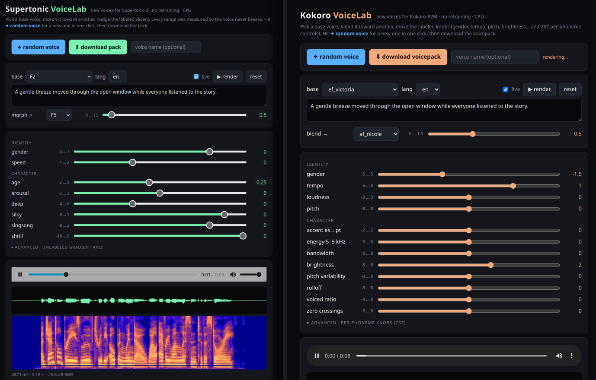
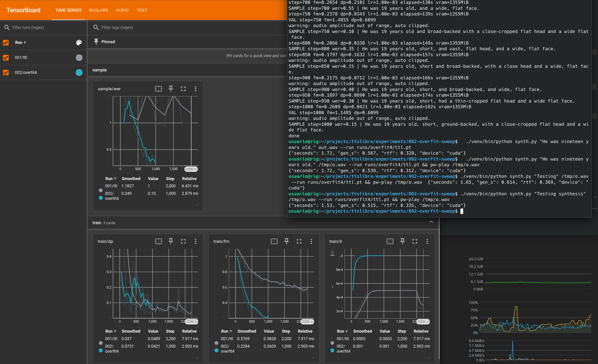

# TTSLibre

**Let's train the FOSS Supertonic / Kokoro successor.**

A text-to-speech model under 100M parameters that answers instantly on a laptop CPU, sounds at least as good as Supertonic 3 and more expressive, and ships with everything needed to reproduce it.

## The deal, in one table

| | Kokoro-82M | Supertonic 3 | **TTSLibre** |
|---|---|---|---|
| Weights | Apache 2.0 | OpenRAIL-M, use restrictions | **CC0, public domain** |
| Training code | not released | not released | **MIT, in this repo** |
| Training data | undisclosed, partly synthetic from closed TTS | undisclosed | **CC0, published with per-clip provenance** |
| Voice tool | none official | none official | **MIT, style vector editor** |
| Params | 82M | ~99M | **under 100M** |
| Runs on | CPU | CPU | **CPU, and GPU under 1 GB** |

Four artifacts, all free, all reproducible: **code, data, weights, voice tool.** You can retrain it, fine-tune it, embed it in a product, or fork the dataset, without asking anyone. That is the whole proposition.

## Prior work this starts from

The voice tool already exists for the two reference models. Both were built by reverse-engineering their style spaces without any training code, and both run on CPU.

- [supertonic-voicelab](https://github.com/franciscocarloserra/supertonic-voicelab): 40 new voice packs for Supertonic 3, sliders with measured safe ranges.
- [kokoro-voicelab](https://github.com/franciscocarloserra/kokoro-voicelab): same for Kokoro-82M, plus 257 per-phoneme knobs.

What those tools could not do is the reason this project exists: they hit the ceiling of what you can do to a model without its training recipe. Retraining a style encoder, adding a language, fixing a bad phoneme, all blocked.

## How it should exist

- **Microscopic.** Under 100M parameters, under 1 GB in memory. Small enough to read the training script in an afternoon and run it on one consumer GPU.
- **Instant.** First audio in well under 100 ms on a laptop CPU. No GPU required to be usable.
- **Better than Supertonic 3.** That is the floor, not the goal: at least equal intelligibility and speaker similarity, and more expressive prosody. Measured, published, side by side.
- **Free all the way down.** No clause anywhere in the stack that a lawyer has to read twice.

## What you get when this works

- A TTS you can embed in any product without asking anyone.
- A dataset you can train your own on.
- A training recipe small enough to read in an afternoon and run on one GPU.
- A voice tool: dial in a new voice from a style vector, no retraining.
- Spanish and other languages as first-class citizens, not afterthoughts.

## Requirements, fixed up front

| Requirement | Target |
|---|---|
| Parameters | under 100M |
| Runtime | CPU and GPU via ONNX |
| Latency | first audio well under 100 ms per sentence on a laptop CPU |
| Memory | under 1 GB VRAM on GPU, under 1 GB RAM on CPU |
| Voices | style vector, new voices without retraining |
| Licenses | MIT code, CC0 data and weights. The most permissive there is. |

Targets are measured, not claimed. Every tunable value lives in a config file, never in code.

## Non-goals

State of the art. Voice cloning from seconds of audio. Emotion control. Anything that needs a GPU to be usable. If some of it comes for free, fine.

## Plan

1. **Data.** Licensing rules, pipeline, first 100 clean hours of English.
2. **Bake-off.** Two or three candidate architectures on those 100 hours. One metric. Results public. Winner sets the architecture.
3. **First checkpoint.** Full English run. It will be rough. Ship it anyway.
4. **Voice tool.** Style-vector editor on top of the checkpoint.
5. **Languages.** Spanish first, then whatever contributors bring.

Worst case this ends as a distillation of Kokoro and Supertonic with a public recipe, and that is still something nobody has published. Best case is a fully human-licensed dataset and a model anyone can ship.

## Two candidate lineages

The bake-off starts from what already works. Both reference implementations are vendored as submodules under `docs/references/`.

- **StyleTTS 2 + ISTFTNet** (Kokoro's lineage). Training code exists and is public. Phoneme input, style diffusion optional, fast ISTFT vocoder.
- **Flow matching over a compressed latent** (Supertonic's lineage). Paper published, no training code. Character input, no G2P, no aligner, ConvNeXt blocks.

## Help wanted

- **Data:** record, curate, align, verify licenses. Rules in `docs/COORDINATION.md`.
- **Architecture:** propose a bake-off candidate as an issue. Bring a config and a reason.
- **Compute:** a 3090/4090-class GPU for ablations. This does not need a swarm.
- **Sponsors:** a few thousand dollars of cloud GPU for the main run.

## Repo layout

- `AGENTS.md` operating brief for humans and agents.
- `docs/` sourced facts: `ARCHITECTURES.md`, `DATASETS.md`, `REFERENCES.md`, `COORDINATION.md`.
- `docs/references/` upstream implementations as submodules (papers linked in `docs/REFERENCES.md`).
- `experiments/NNN-*/` one directory per experiment, each with its README, config and result.
- Training data is not in git. It is distributed via Hugging Face (`ttslibre`); license audit in `docs/LICENSES.md`.

## Status

Pre-alpha. The Supertonic-lineage prototype in `experiments/` trains end to end (latent autoencoder, text-to-latent flow matching, ONNX export, Whisper WER in TensorBoard). First alignment reached on 2026-09-05: a 4-utterance overfit reaches WER 0.15 in 1000 steps on 1.4 GiB VRAM (`experiments/002-overfit-sweep/RESULTS.md`). Nothing generalizes yet.

Clone with `--recurse-submodules` to get the references.
